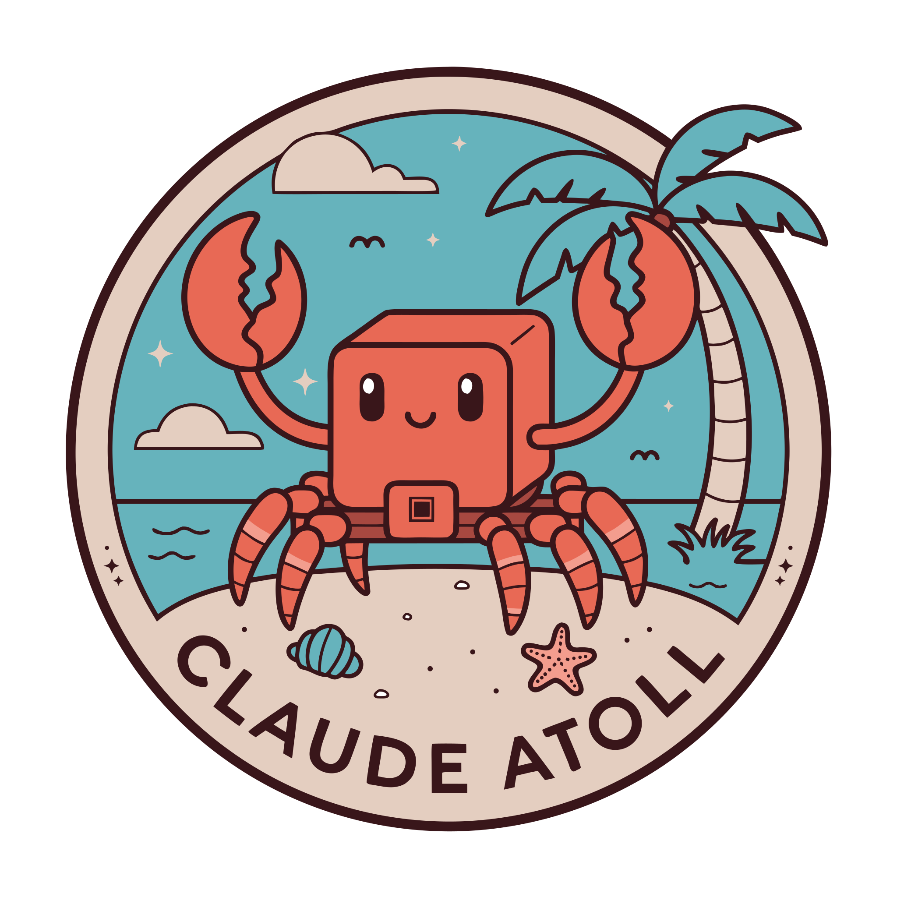

# Claude Island Web

<p align="center">
  
</p>

<p align="center">
  <strong>The official website for Claude Island</strong><br>
  A Dynamic Island-style macOS menu bar app for Claude Code CLI
</p>

<p align="center">
  <a href="https://claudeisland.engels74.net">Visit Website</a> •
  <a href="https://github.com/engels74/claude-island">View macOS App</a>
</p>

---

## About

Claude Island Web is the static website for [Claude Island](https://github.com/engels74/claude-island), a macOS menu bar application that provides a beautiful Dynamic Island-style overlay for monitoring and interacting with Claude Code CLI sessions.

**Live at:** [claudeisland.engels74.net](https://claudeisland.engels74.net)

### What the Website Offers

- **Product Overview** — Learn about Claude Island's features and capabilities
- **Download Links** — Get the latest version of the macOS app directly
- **How It Works** — Step-by-step guide to setting up and using Claude Island
- **FAQ** — Answers to common questions about the app

### About Claude Island (the macOS App)

Claude Island enhances your Claude Code workflow with:

- **Notch UI** — Beautiful Dynamic Island-style overlay that lives in your menu bar
- **Live Sessions** — Real-time monitoring of all your Claude Code CLI sessions
- **Quick Approvals** — Approve or deny tool requests directly from the overlay
- **Chat History** — Browse and review your conversation history with Claude

## Tech Stack

| Technology | Purpose |
|-----------|---------|
| [Bun](https://bun.sh) | Runtime and package manager |
| [Astro 5](https://astro.build) | Static site generator |
| [Svelte 5](https://svelte.dev) | Interactive components (islands) |
| [UnoCSS](https://unocss.dev) | Atomic CSS framework |
| [Biome](https://biomejs.dev) | Linting and formatting |

## Commands

All commands are run from the root of the project:

| Command | Action |
|---------|--------|
| `bun install` | Install dependencies |
| `bun run dev` | Start dev server at `localhost:4321` |
| `bun run build` | Build for production (includes type checking) |
| `bun run preview` | Preview production build locally |
| `bun run check` | Run Astro + Svelte type checking |
| `bun run lint` | Check code with Biome |
| `bun run lint:fix` | Auto-fix lint issues |
| `bun run format` | Format code with Biome |

## Project Structure

```
claude-island-web/
├── public/
│   └── favicon.svg          # Site icon
├── src/
│   ├── assets/              # Optimized images
│   ├── components/          # Astro and Svelte components
│   │   ├── DownloadButton.svelte
│   │   ├── DownloadCTA.astro
│   │   ├── FAQ.astro
│   │   ├── Features.astro
│   │   ├── Footer.astro
│   │   ├── Hero.astro
│   │   ├── HowItWorks.astro
│   │   └── Nav.astro
│   ├── layouts/
│   │   └── Layout.astro     # Base layout
│   └── pages/
│       └── index.astro      # Landing page
├── astro.config.mjs         # Astro configuration
├── uno.config.ts            # UnoCSS configuration
├── biome.json               # Biome linting rules
└── package.json
```

## Development

### Prerequisites

- [Bun](https://bun.sh) runtime installed

### Getting Started

```bash
# Install dependencies
bun install

# Start the development server
bun run dev

# Open http://localhost:4321 in your browser
```

### Building for Production

```bash
# Build the site
bun run build

# Preview the build
bun run preview
```

## License

This project is part of [Claude Island](https://github.com/engels74/claude-island). See the main repository for license information.
